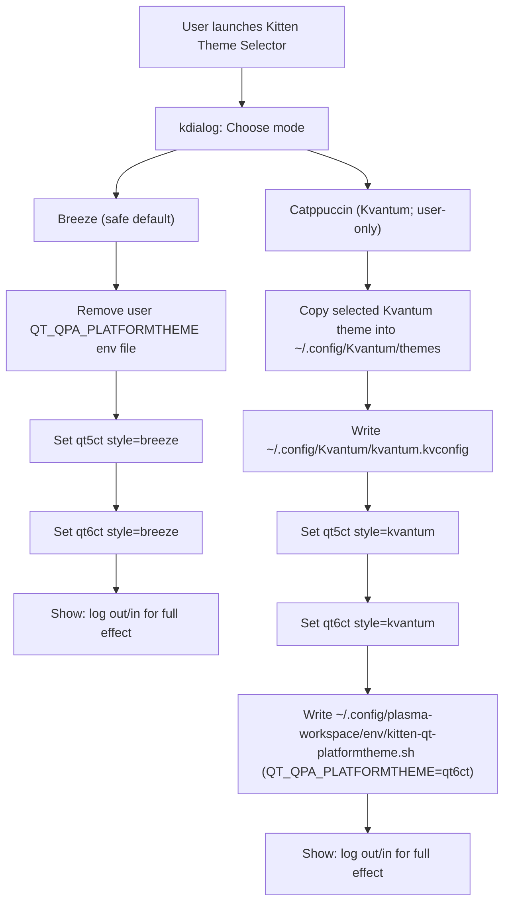

# Kitest OS (archiso profile)

Arch Linux live ISO profile: Plasma desktop, **[archinstall](https://github.com/archlinux/archinstall)** (official `[extra]` package) as the guided installer, **Catppuccin Kvantum** + **qt6ct** defaults on the live session, and optional package-group references under **`/usr/share/kitest/`** (see `netinstall-bundles.yaml` and `archinstall-examples/`). Use **Kitten Theme Selector** to switch back to Breeze if a VM misbehaves.

- **License:** [MIT](LICENSE) for this profile’s files; toolchain and upstream packages have their own licenses (see LICENSE).
- **Contributing:** [CONTRIBUTING.md](CONTRIBUTING.md)

### Mental model

- **`mkarchiso` → `pacstrap`** uses **this profile’s `pacman.conf`**, not the host’s `/etc/pacman.conf`.
- Only **official Arch** repositories **`[core]`**, **`[extra]`**, and optional **`[kitten-local]`** (custom kernel) are used — no third-party installer repo.

### Package lists (`packages.d` vs `packages.x86_64`)

**Edit the fragments** under [`packages.d/`](packages.d/). Running **`build-iso.sh`** invokes [`scripts/gen-packages.sh`](scripts/gen-packages.sh), which **regenerates** [`packages.x86_64`](packages.x86_64). Do not treat `packages.x86_64` as the source of truth unless you are only inspecting the merged output. The **`archinstall`** package is listed in **`packages.d/10-archiso-base.list`** (upstream releng parity); **`packages.d/50-archinstall.list`** is reserved for installer-related notes.

## Build on Arch (native)

Needs **root**. **Network is only required when a step can’t be satisfied from cache** (pacstrap downloads, optional Catppuccin git fetch, kernel deps/sources).

```bash
sudo ./build-iso.sh
```

ISO output: `/var/tmp/kitest-out/` (override with `WORK_DIR` / `OUT_DIR`).

### Layered / incremental builds (recommended)

This repo supports a “layered” workflow so you don’t rebuild expensive pieces every time.

- **Layer 1 — kernel artifact** (rare):

```bash
sudo ./scripts/build-kernel.sh
```

- **Layer 2 — local repo refresh** (sometimes):

```bash
sudo ./scripts/prepare-repo.sh
```

- **Layer 3 — ISO build** (often):

```bash
sudo ./build-iso.sh
```

### Building variants (kernel / Broadcom)

Package selection is **composed** from fragments in `packages.d/`. Pick variants via env vars:

- **Kernel**: `KITEST_KERNEL=kitten` (default) or `KITEST_KERNEL=linux`
- **Broadcom**: `KITEST_BRCM_DRIVER=b43` (default) or `KITEST_BRCM_DRIVER=wl`

If you want multiple ISOs from one tree, use **separate** `WORK_DIR` and `OUT_DIR` per variant to avoid cache contamination:

```bash
WORK_DIR=/var/tmp/kitest-work-kitten OUT_DIR=/var/tmp/kitest-out-kitten \
  KITEST_KERNEL=kitten KITEST_BRCM_DRIVER=b43 sudo ./build-iso.sh

WORK_DIR=/var/tmp/kitest-work-linux OUT_DIR=/var/tmp/kitest-out-linux \
  KITEST_KERNEL=linux KITEST_BRCM_DRIVER=wl sudo ./build-iso.sh
```

#### Reusing `WORK_DIR` (mkarchiso cache)

By default, `./build-iso.sh` **reuses** `WORK_DIR` for faster rebuilds (it no longer wipes the whole work directory each run).

To control cleaning, use `KITEST_CLEAN`:

- **Keep everything (default)**: `KITEST_CLEAN=none`
- **Rebuild rootfs layer but keep caches**: `KITEST_CLEAN=airootfs`
- **Full wipe**: `KITEST_CLEAN=work` (or `all`)

Example:

```bash
KITEST_CLEAN=airootfs sudo ./build-iso.sh
```

#### Offline-first

To force “no network” (fail fast if something would need downloading):

```bash
KITEST_OFFLINE=1 sudo ./build-iso.sh
```

Notes:

- Kernel build deps installation is skipped when `KITEST_OFFLINE=1` (so ensure deps are preinstalled if you want a true offline kernel rebuild attempt).

## Kernel: Kitten CachyOS-style (hardened + BORE)

This profile replaces the stock Arch `linux` package with a **CachyOS-style hardened+BORE** kernel package built from the PKGBUILD under:

- [`pkgs/linux-kitten-cachy/PKGBUILD`](pkgs/linux-kitten-cachy/PKGBUILD)

During `./build-iso.sh`, the kernel package is built with `makepkg` (via `scripts/build-kernel.sh`) and added to a local pacman repo:

- repo: **`[kitten-local]`** in [`pacman.conf`](pacman.conf)
- path: **`file:///var/tmp/kitest-localrepo`**

The ISO still boots using the **standard archiso filenames**:

- `/boot/vmlinuz-linux`
- `/boot/initramfs-linux.img`

To keep bootloader entries unchanged, [`customize_airootfs.sh`](airootfs/root/customize_airootfs.sh) copies the kernel image from `/usr/lib/modules/*/vmlinuz` into `/boot/vmlinuz-linux` during ISO build, then runs **`mkinitcpio -p linux`** (the `linux.preset` contains the `archiso` preset) so **`/boot/initramfs-linux.img`** exists. Without that step (and/or without the kernel package installing `/boot/vmlinuz-linux` early), pacstrap-time hooks may only build **`initramfs-<pkgbase>.img`** (e.g. `initramfs-linux-kitten-cachyos-hardened.img`), while **systemd-boot still references `initramfs-linux.img`** — which causes an immediate return to the boot menu (missing initrd).

**Faster rebuilds (optional):** kernel builds are already cache-aware:\n+\n+- `scripts/build-kernel.sh` (and `./build-iso.sh`) reuses existing `linux-kitten-cachyos-hardened*.pkg.tar.zst` in `LOCALREPO_DIR` when `PKGBUILD` + `config` are unchanged (see `.kernel-src-stamp`).\n+- Set `KITEST_FORCE_KERNEL_REBUILD=1` to force a full kernel compile.\n+- Set `KITEST_SKIP_KERNEL_BUILD=1` only if packages are already in the local repo.\n+- Persistent `makepkg` tree: `KITEST_KERNEL_BUILD_DIR` (default `LOCALREPO_DIR/.kernel-build`).

**Important:** the Kitten kernel package `provides=(linux)` and `conflicts=(linux)` so pacstrap does not install the stock Arch `linux` package alongside it (a kernel/initramfs modules mismatch will break boot device detection in initramfs).

**SPICE / QEMU:** `spice-vdagent` and `qemu-guest-agent` are in the package list; do not ship a duplicate `/etc/xdg/autostart/spice-vdagent.desktop` in `airootfs` — the package already installs it.

## Build in Docker (Ubuntu, macOS, etc.)

`mkarchiso` → `pacstrap` → `mount` on `/proc` inside the chroot. A plain `docker run` is **not** enough: the default container security profile blocks those mounts, so you get:

`mount: .../proc: permission denied` / `failed to setup chroot`.

Run the container **`--privileged`** (simplest and what upstream archiso docs expect for containers). The build needs **network** inside the container for `pacstrap` unless everything is cached.

```bash
docker run --rm -it --privileged \
  -v "${PWD}:/profile" \
  -v kitest-iso-out:/var/tmp/kitest-out \
  archlinux:latest \
  bash -lc 'pacman -Sy --needed --noconfirm archiso arch-install-scripts curl && cd /profile && OUT_DIR=/var/tmp/kitest-out ./build-iso.sh'
```

The ISO appears in the named volume `kitest-iso-out`. To copy it to the host directory instead:

```bash
docker run --rm -it --privileged \
  -v "${PWD}:/profile" \
  -v "${PWD}/out:/var/tmp/kitest-out" \
  archlinux:latest \
  bash -lc 'pacman -Sy --needed --noconfirm archiso arch-install-scripts curl && cd /profile && OUT_DIR=/var/tmp/kitest-out ./build-iso.sh'
```

Then find `out/*.iso` on the host.

### Docker Compose (repeatable builds)

```bash
mkdir -p out
docker compose run --rm build-iso
```

ISOs land in **`./out/`**. Package downloads are cached in the **`kitest-pacman-cache`** volume between runs.

Rolling base, CI, and “do we fork Arch?” are summarized in [docs/devops.md](docs/devops.md).

## Running the ISO (USB, VMs, persistence, archinstall)

### Installer is not the firmware boot menu

Boot order is always: **firmware (Syslinux / systemd-boot) → Linux → SDDM → Plasma session**.

The installer is **[archinstall](https://wiki.archlinux.org/title/Archinstall)** (TUI), launched through a **hybrid wrapper** from the **Install Kitest OS** desktop icon. The wrapper runs `sudo archinstall` and then enforces the Kitest post-install profile in the installed target (`arch-chroot /mnt`). A **first-run** autostart script (**`kitest-live-first-run`**) configures Flathub and applies the configured Flatpak bundle(s) once per user (best-effort). If you only see a black screen, wait for **SDDM**, then log in as **`kitest`** (password **empty** / unset). If you changed the live user at build time, use `KITEST_LIVE_USER`’s value instead.

Optional package groups from the old Calamares netinstall are documented in **`/usr/share/kitest/netinstall-bundles.yaml`** and example JSON fragments in **`/usr/share/kitest/archinstall-examples/`** — merge **`packages`** into your saved **`archinstall`** configuration or pick the same names under **Additional packages** in the TUI.

### Finding the persistence partition (auto-detect + `KITEST_PERSIST` fallback)

Persistent boot now uses **`cow_autodetect=1`** plus **`cow_label=KITEST_PERSIST`** fallback. The initramfs hook auto-selects a writable Linux filesystem for the overlay when the fixed label is absent. Keeping a partition labeled **`KITEST_PERSIST`** is still recommended as an explicit fallback.

On any Linux system (host or live session), check labels:

```bash
lsblk -f
sudo blkid | grep -i kitest
ls -l /dev/disk/by-label/
```

You should see a line like **`LABEL="KITEST_PERSIST"`** and a symlink **`/dev/disk/by-label/KITEST_PERSIST`** when using explicit label mode; otherwise auto-detect can still pick a suitable writable partition.

### USB flash drive

1. Write the ISO to the stick (first partition is the ISO / FAT volume from `mkarchiso`).
2. For **persistence**, add another partition on the **same** USB device (e.g. **ext4**). Labeling it `KITEST_PERSIST` is recommended:

   ```bash
   sudo mkfs.ext4 -L KITEST_PERSIST /dev/sdXN
   ```

   Replace **`/dev/sdXN`** with your second partition (see `lsblk`). **Do not** put that label on the ISO partition itself.

3. Boot **Kitest OS - live session** for normal RAM overlay, or **Kitest OS - persistent live** when that second partition is present.

**“Failed to mount root device” / “can’t access TTY” / emergency shell:** this is an **initramfs / archiso** problem (finding the ISO + `airootfs.sfs`, or the persistence overlay) — it happens **before** Plasma or [`customize_airootfs.sh`](airootfs/root/customize_airootfs.sh) (that script runs at **ISO build** time, not on boot). It is **not** Kvantum/theme-related. Typical causes: unsuitable persistence disk/filesystem, bad/corrupt ISO, wrong kernel cmdline, or flaky USB. Boot **live session** first; try **`copytoram`** / **`rd.debug`** per [archiso boot params](https://gitlab.archlinux.org/archlinux/mkinitcpio/mkinitcpio-archiso/-/blob/master/docs/README.bootparams).

This profile uses **`archisosearchuuid=`** (substituted by **`mkarchiso`**) and **`archisobasedir=arch`** — see [`profiledef.sh`](profiledef.sh). Full checklist: **[`docs/troubleshooting-initramfs.md`](docs/troubleshooting-initramfs.md)**.

More on persistence layout: [`airootfs/usr/share/doc/kitest/persistence.txt`](airootfs/usr/share/doc/kitest/persistence.txt).

### QEMU / KVM (`qemu-smoke.sh`)

After the build:

```bash
./qemu-smoke.sh /var/tmp/kitest-out/*.iso
```

- **Intel CPU + KVM:** QEMU may print `CPUID... svm` — the script uses **`-cpu host,-svm`** by default on non-AMD hosts. Override with **`QEMU_CPU=host`** if needed.
- **No `/dev/kvm` (TCG):** the guest is **very slow**; the screen may stay black for a long time before SDDM. Prefer **KVM**.
- **Black screen after boot text:** wait, try **Ctrl+Alt+F2** for a text login, or raise **RAM** (e.g. `MEM=8192 ./qemu-smoke.sh …`).
- **Kernel log on the host terminal (debug):** `QEMU_EXTRA_ARGS="-serial stdio" ./qemu-smoke.sh out/*.iso` (may interact oddly with the GTK window; use `QEMU_HEADLESS=1` for serial-only).
- **Live networking:** **NetworkManager** + **systemd-resolved** (Ethernet/Wi‑Fi in Plasma via **plasma-nm**). **systemd-networkd** is **masked** on the live image so it does not fight NM. **cloud-init** and **ModemManager** stay masked to reduce QEMU flapping. **`/etc/resolv.conf`** symlinks to the **systemd-resolved stub**; public **FallbackDNS** is in `airootfs/etc/systemd/resolved.conf.d/99-qemu-fallback.conf`. If something fails, check `journalctl -u NetworkManager -b` and `resolvectl status`.
- **QEMU user NAT vs ping:** with **`-netdev user`**, **ICMP (`ping`) often fails** even when **HTTPS/DNS work** — use **`curl`** / **`dig`** / **`pacman`** to verify connectivity. Details: [`network_issues.md`](network_issues.md). For **ping** and full LAN behavior, use a **host bridge** (see below).
- **Guest ↔ host (QEMU user networking):** from the guest, the host is **`10.0.2.2`** (TCP/HTTP to host services; ping may not work). To reach the **guest from the host** (e.g. SSH after `systemctl start sshd`), forward a host port: `QEMU_HOSTFWD='hostfwd=tcp::2222-:22' ./qemu-smoke.sh out/*.iso` then `ssh -p 2222 user@127.0.0.1`.
- **QEMU bridge networking:** if the host has a Linux bridge (e.g. **`br0`**) and **`/etc/qemu/bridge.conf`** allows it, run `QEMU_BRIDGE=br0 ./qemu-smoke.sh out/*.iso` instead of user NAT.
- **“Persistent live” in QEMU (recommended):** let the script create/attach a persistence disk automatically:

```bash
QEMU_PERSIST=1 ./qemu-smoke.sh out/*.iso
```

This creates a raw ext4 image alongside the ISO (name `*.persist.img`) labeled **`KITEST_PERSIST`** and attaches it as a second virtio disk. For **clean testing**, the auto image is **recreated each run**; to keep state between boots, set `QEMU_PERSIST_KEEP=1`. Then select **Kitest OS - persistent live** in the firmware menu.

If you still see a black screen in QEMU, try the OpenGL-backed device (often better for Plasma):

```bash
QEMU_GPU=virtio-gl QEMU_PERSIST=1 ./qemu-smoke.sh out/*.iso
```

- **“Persistent live” in QEMU (manual):** if you want full control, attach a **second** virtio disk whose **filesystem** is labeled **`KITEST_PERSIST`**:

```bash
truncate -s 512M /tmp/kitest-persist.img
mkfs.ext4 -L KITEST_PERSIST /tmp/kitest-persist.img
QEMU_PERSIST_IMG=/tmp/kitest-persist.img ./qemu-smoke.sh out/*.iso
```

Without that disk, use the default **live session** entry. If you see **overlayfs** / **root** errors with persistence, boot **live session** first and verify the extra disk label is **`KITEST_PERSIST`** (see `docs/troubleshooting-initramfs.md`).

**Host AMD GPU (VFIO)** for driver testing: bind the card to `vfio-pci`, then e.g. `QEMU_VFIO_GPU=0000:0c:00.0 ./qemu-smoke.sh out/*.iso` or `QEMU_TRY_AMD_VFIO=1 ./qemu-smoke.sh …`. Guest video is on the **passed-through GPU** (not the virtio window).

### Proxmox VE (and similar libvirt/KVM UIs)

- Create a VM with **UEFI (OVMF)** or **SeaBIOS** — the hybrid ISO supports both.
- **CD/DVD drive:** attach the ISO (SCSI or IDE SATA).
- **Boot order:** CD/DVD first for the first boot.
- **Default “live session”:** no extra disk required.
- **Persistent live:** add a **second** VirtIO Block (or SCSI) disk, then from a **Linux** host (or another VM) run **`mkfs.ext4 -L KITEST_PERSIST` on that disk** (`qemu-img` / `dd` a raw file, or use Proxmox’s disk UI and then format from a live ISO). Until that label exists, **do not** boot the **persistent** entry — use **live session**.
- **VirtIO** (`virtio-scsi` / `virtio-blk`) is fine; the kernel and initramfs include the usual drivers.

### archinstall / Konsole

1. Use the **Install Kitest OS** launcher (recommended): it runs the hybrid flow (`sudo archinstall` + enforced Kitest post-install).
2. You can still run **`archinstall`** manually for pure upstream behavior.
3. If **`pacman-key`** / mirror errors appear inside **archinstall**, see [archinstall known issues](https://archinstall.readthedocs.io/en/latest/help/known_issues.html) (e.g. refresh **`archlinux-keyring`**).

The live image sets SDDM **`DisplayServer=x11`** in [`airootfs/etc/sddm.conf.d/10-x11-greeter.conf`](airootfs/etc/sddm.conf.d/10-x11-greeter.conf) so the greeter stays on X11.

**QEMU smoke tests:** default [`qemu-smoke.sh`](qemu-smoke.sh) uses **`QEMU_GPU=virtio-gl`**. If the guest desktop is unstable, try **`QEMU_GPU=qxl`**.

### Debug: black screen / blank windows (Plasma)

If you hit a black/blank UI, grab logs first (GPU/compositor or Qt style). Use **Kitten Theme Selector** to return to Breeze.

- **System logs**:

```bash
journalctl -b --no-pager | tail -200
journalctl --user -b --no-pager | tail -200
```

## Agent skill (Cursor / AI)

Project notes for archiso + this profile: [`.skill/SKILL.md`](.skill/SKILL.md). To load as a Cursor project skill, copy or symlink that folder to `.cursor/skills/kitten-arch-kitest/`.

## CI

- Lint: `.github/workflows/lint.yml`
- ISO build: `.github/workflows/build-archiso.yml` (Arch container with **privileged** so `pacstrap` works)

## Mirrors and big downloads

`pacman.conf` uses **Rackspace and Leaseweb first**, **`geo.mirror.pkgbuild.com` last**, plus **`ParallelDownloads = 3`**, so huge `pacstrap` runs are less likely to hit SSL resets on the CDN mid-transaction.

Optional **Flatpak** apps are controlled by [`airootfs/usr/share/kitest/install-config.sh`](airootfs/usr/share/kitest/install-config.sh). By default, first-run and hybrid post-install keep the default bundle and add the Kitest extra bundle.

## Themes (Catppuccin Kvantum default; Breeze via selector)

[`customize_airootfs.sh`](airootfs/root/customize_airootfs.sh) installs Catppuccin assets into **`/usr/share/kvantum/themes/`** (system-wide; **`/usr/share/kitten-themes/kvantum`** is a symlink to the same tree). It writes **`~/.config/Kvantum/kvantum.kvconfig`** with a **`theme=`** name that resolves to those directories (no per-user copy of SVG/theme files). The same defaults are applied to **`/etc/skel`** before the live user is created, so **archinstall-created accounts** inherit qt6ct + Kvantum. **`QT_QPA_PLATFORMTHEME=qt6ct`** is exported via **`/etc/environment.d/99-qt.conf`** and **`/etc/profile.d/qt-platformtheme.sh`** so the theme state is active by default at login.

### Kitten Theme Selector (user-only; safe defaults)

The live ISO ships a **Kitten Theme Selector** entry in:

- the **application menu** (search for “Theme”)
- the **Desktop** (skel shortcut for the live user)

It is implemented by:

- launcher: [`airootfs/usr/share/applications/kitten-theme-selector.desktop`](airootfs/usr/share/applications/kitten-theme-selector.desktop)
- desktop shortcut: [`airootfs/etc/skel/Desktop/kitten-theme-selector.desktop`](airootfs/etc/skel/Desktop/kitten-theme-selector.desktop)
- script: [`airootfs/usr/local/bin/kitten-theme-selector`](airootfs/usr/local/bin/kitten-theme-selector)

**Design rule:** it only writes **user config** under `$HOME` (no global environment overrides).

#### What it changes (files)

- **Breeze mode (safe):**
  - `~/.config/qt5ct/qt5ct.conf` → `style=breeze`
  - `~/.config/qt6ct/qt6ct.conf` → `style=breeze`
  - removes `~/.config/plasma-workspace/env/kitten-qt-platformtheme.sh` if present

- **Catppuccin (Kvantum; user-only):**
  - copies chosen theme folder from **`/usr/share/kitten-themes/kvantum/`** into `~/.config/Kvantum/themes/<theme>`
  - writes `~/.config/Kvantum/kvantum.kvconfig`
  - sets `style=kvantum` in `~/.config/qt5ct/qt5ct.conf` and `~/.config/qt6ct/qt6ct.conf`
  - writes `~/.config/plasma-workspace/env/kitten-qt-platformtheme.sh` to export `QT_QPA_PLATFORMTHEME=qt6ct` **for that user only**

After switching, new logins pick the theme automatically; restart currently-open Qt apps for immediate refresh.

#### Workflow diagram



### Bundling Catppuccin Kvantum themes into the ISO

Bundling themes (default **on**) populates **`/usr/share/kvantum/themes/`** so the live session and **Kitten Theme Selector** work **offline**. With **`KITEST_BUNDLE_CATPPUCCIN_KVANTUM=0`**, only Breeze/Materia-style packages apply unless you install themes manually.

If you want to **disable** bundling (smaller build / no extra assets), build with:

```bash
KITEST_BUNDLE_CATPPUCCIN_KVANTUM=0 sudo ./build-iso.sh
```

Bundled themes are installed into **`/usr/share/kvantum/themes/`** (with **`/usr/share/kitten-themes/kvantum`** as a symlink) for the theme tools and live user seeding.

#### Reproducible/offline bundling (vendored asset)

For fully reproducible builds without relying on network at build time, you can vendor the Catppuccin Kvantum source archive into the profile so it is available inside the build chroot:

- Place `catppuccin-kvantum.tar.gz` at: `airootfs/usr/share/kitest/assets/catppuccin-kvantum.tar.gz`
- Optionally add a checksum file next to it: `airootfs/usr/share/kitest/assets/catppuccin-kvantum.tar.gz.sha256` (format: `sha256sum -b <file>`)

During ISO build, `customize_airootfs.sh` will prefer this vendored tarball; otherwise it may attempt a network fetch if `KITEST_ALLOW_NET_ASSETS=1`.

### Manual Kvantum after login (example):

```bash
sudo pacman -S --needed git
git clone --depth 1 https://github.com/catppuccin/kvantum.git /tmp/catppuccin-kvantum
sudo cp -a /tmp/catppuccin-kvantum/themes/. /usr/share/Kvantum/themes/
# Theme folder names are lowercase, e.g. catppuccin-mocha-mauve
mkdir -p ~/.config/Kvantum
printf '[General]\ntheme=catppuccin-mocha-mauve\n' > ~/.config/Kvantum/kvantum.kvconfig
# System Settings -> Appearance -> Application Style -> kvantum (or qt6ct)
```

See [Catppuccin ports](https://catppuccin.com/ports/) for more.

## Build: mkinitcpio “Possibly missing firmware for module: …”

During `mkarchiso` you may see many lines like **`ast`**, **`wd719x`**, **`qla2xxx`**, etc. Generic images **include kernel modules** for hardware you may not have; **firmware** for those chips is often **optional** or **not** shipped. **`linux-firmware`** is already in the list. **Most of these warnings are harmless** unless you are building for that exact hardware.

**`ast`** (ASPEED BMC VGA): this profile ships [`airootfs/etc/modprobe.d/blacklist-drm-ast.conf`](airootfs/etc/modprobe.d/blacklist-drm-ast.conf) so the module is not loaded on normal desktops. Remove the blacklist if you need that GPU.

## After install (EFI / boot)

Disk layout and bootloader are chosen inside **archinstall**. If the system does not boot, verify EFI mountpoints and bootloader settings from the install log under **`/var/log/archinstall/`** on the live session or target system.
