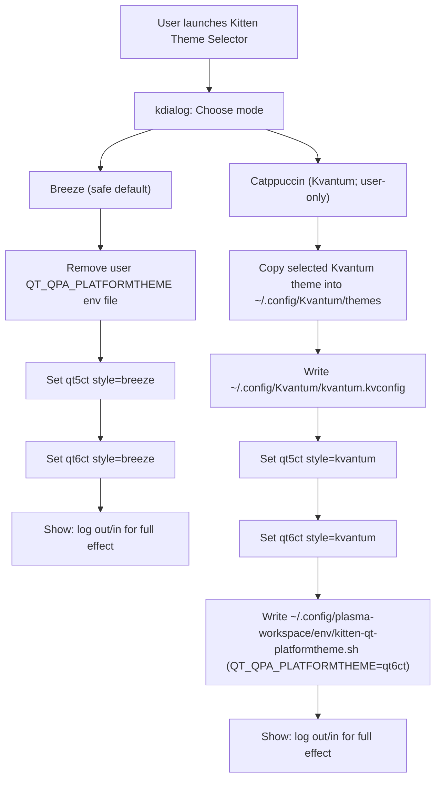

# Kitest OS (archiso profile)

Arch Linux live ISO profile: Plasma desktop (**Breeze** Qt style by default), optional Calamares installer, and curated optional bundles (see `airootfs/etc/calamares/`). **Kvantum** is optional; install/configure manually after login if you want it.

- **License:** [MIT](LICENSE) for this profile’s files; toolchain and upstream packages have their own licenses (see LICENSE).
- **Contributing:** [CONTRIBUTING.md](CONTRIBUTING.md)

## Why `pacman` said: `error: target not found: calamares`

Official Arch repositories **`[core]`** and **`[extra]`** do **not** ship the **Calamares** package. Upstream publishes it on the [AUR](https://aur.archlinux.org/packages/calamares); you need a **third-party binary repo** (or a local `makepkg` build) to install it with `pacstrap`.

A plain `pacstrap` using only Rackspace/Leaseweb/geo mirrors **cannot** install `calamares` until a repo that provides it is enabled and trusted. Typical failures:

```text
:: Synchronizing package databases...
 core   … 100%
 extra  … 100%
error: target not found: calamares
==> ERROR: Failed to install packages to new root
```

If you already added **`[chaotic-aur]`** and see **`chaotic-aur … 100%`** but **still** get `target not found: calamares`, the repo database is syncing but **there is no `calamares` package in that sync DB** (Chaotic does not publish it—see [Chaotic-AUR](https://aur.chaotic.cx/) vs [AUR `calamares`](https://aur.archlinux.org/packages/calamares)). This profile uses the **[EndeavourOS](https://endeavouros.com/)** repository instead, which **does** ship `calamares` (same idea as [their ISO package list](https://github.com/endeavouros-team/EndeavourOS-ISO/blob/main/packages.x86_64)).

**Sources:** [AUR `calamares`](https://aur.archlinux.org/packages/calamares), [Arch Wiki — Calamares](https://wiki.archlinux.org/title/Calamares), EndeavourOS [mirrorlist upstream](https://github.com/endeavouros-team/PKGBUILDS/tree/master/endeavouros-mirrorlist).

### Mental model

- **`mkarchiso` → `pacstrap`** uses **this profile’s `pacman.conf`**, not the host’s `/etc/pacman.conf`.
- You still need **EndeavourOS signing keys on the build host** so `pacman` can **verify** `endeavouros-keyring` / `endeavouros-mirrorlist` / `calamares` while installing into the airootfs. Those `.pkg.tar.zst` files are signed with keys that are **not** in the Arch Linux keyring until the EndeavourOS keyring is loaded. **`scripts/bootstrap-endeavouros-pacman.sh`** (called from **`build-iso.sh`** and CI) copies [`endeavouros.gpg` + trusted/revoked lists](https://github.com/endeavouros-team/keyring) into `/usr/share/pacman/keyrings/`, runs **`pacman-key --populate endeavouros`**, then **`pacman -U`** the two keyring packages from a mirror. If you see **`invalid or corrupted package (PGP signature)`** or an interactive **`Import PGP key … ?`**, clear stale downloads (`rm /var/cache/pacman/pkg/endeavouros-*.pkg.tar.zst*`) and re-run; do not run `pacman -U` on those packages before populating the EOS keyring. If **`endeavouros-keyring: … exists in filesystem`**, the bootstrap script uses **`pacman -U --overwrite`** on the three `endeavouros*` keyring paths so the official package can replace the pre-seeded copies.

### What this profile does

1. **`pacman.conf`** appends **`[endeavouros]`** with **`SigLevel = PackageRequired`** and **`Include = /etc/pacman.d/endeavouros-mirrorlist`** (after `[extra]`).
2. **`airootfs/etc/pacman.d/endeavouros-mirrorlist`** ships mirror `Server =` lines inside the live image.
3. **`packages.d/50-calamares.list`** lists **`endeavouros-mirrorlist`**, **`endeavouros-keyring`**, **`calamares`**, **`kpmcore`**, **`yaml-cpp`** (keyring before Calamares; **`yaml-cpp`** supplies **`libyaml-cpp.so`** if the installer binary does not pull it in).
4. **`build-iso.sh`** runs **`scripts/bootstrap-endeavouros-pacman.sh`**: populate EOS keys from GitHub, then **`pacman -U`** the latest **`endeavouros-keyring`** / **`endeavouros-mirrorlist`** from **`EOS_PKG_BASE`** (default: Gigenet US mirror) before `mkarchiso`.

Installer **configuration** is **not** a separate `calamares-config` package here: this repo **is** the config under [`airootfs/etc/calamares/`](airootfs/etc/calamares/). Module files that **also ship inside the `calamares` package** (e.g. `bootloader.conf`, `users.conf`) are staged under [`airootfs/usr/share/kitest/calamares-modules/`](airootfs/usr/share/kitest/calamares-modules/) and copied into `/etc/calamares/modules/` in [`customize_airootfs.sh`](airootfs/root/customize_airootfs.sh) so `pacstrap` does not hit **“exists in filesystem”**. If you see hints about a generic “partition” module with no config, ensure these files are present in the built image.

## Build on Arch (native)

Needs **root** and **network** (for the EndeavourOS keyring bootstrap), then `mkarchiso`:

```bash
sudo ./build-iso.sh
```

ISO output: `/var/tmp/kitest-out/` (override with `WORK_DIR` / `OUT_DIR`).

## Kernel: Kitten CachyOS-style (hardened + BORE)

This profile replaces the stock Arch `linux` package with a **CachyOS-style hardened+BORE** kernel package built from the PKGBUILD under:

- [`pkgs/linux-kitten-cachy/PKGBUILD`](pkgs/linux-kitten-cachy/PKGBUILD)

During `./build-iso.sh`, the kernel package is built with `makepkg` and added to a local pacman repo:

- repo: **`[kitten-local]`** in [`pacman.conf`](pacman.conf)
- path: **`file:///var/tmp/kitest-localrepo`**

The ISO still boots using the **standard archiso filenames**:

- `/boot/vmlinuz-linux`
- `/boot/initramfs-linux.img`

To keep bootloader entries unchanged, [`customize_airootfs.sh`](airootfs/root/customize_airootfs.sh) copies the kernel image from `/usr/lib/modules/*/vmlinuz` into `/boot/vmlinuz-linux` during ISO build, then runs **`mkinitcpio -p linux`** (the `linux.preset` contains the `archiso` preset) so **`/boot/initramfs-linux.img`** exists. Without that step (and/or without the kernel package installing `/boot/vmlinuz-linux` early), pacstrap-time hooks may only build **`initramfs-<pkgbase>.img`** (e.g. `initramfs-linux-kitten-cachyos-hardened.img`), while **systemd-boot still references `initramfs-linux.img`** — which causes an immediate return to the boot menu (missing initrd).

**Faster rebuilds (optional):** `./build-iso.sh` reuses existing `linux-kitten-cachyos-hardened*.pkg.tar.zst` in `LOCALREPO_DIR` when `PKGBUILD` + `config` are unchanged (see `.kernel-src-stamp`). Set `KITEST_FORCE_KERNEL_REBUILD=1` to force a full kernel compile. Set `KITEST_SKIP_KERNEL_BUILD=1` only if packages are already in the local repo. Persistent `makepkg` tree: `KITEST_KERNEL_BUILD_DIR` (default `LOCALREPO_DIR/.kernel-build`).

**Important:** the Kitten kernel package `provides=(linux)` and `conflicts=(linux)` so pacstrap does not install the stock Arch `linux` package alongside it (a kernel/initramfs modules mismatch will break boot device detection in initramfs).

**SPICE / QEMU:** `spice-vdagent` and `qemu-guest-agent` are in the package list; do not ship a duplicate `/etc/xdg/autostart/spice-vdagent.desktop` in `airootfs` — the package already installs it.

## Build in Docker (Ubuntu, macOS, etc.)

`mkarchiso` → `pacstrap` → `mount` on `/proc` inside the chroot. A plain `docker run` is **not** enough: the default container security profile blocks those mounts, so you get:

`mount: .../proc: permission denied` / `failed to setup chroot`.

Run the container **`--privileged`** (simplest and what upstream archiso docs expect for containers). The build needs **network** inside the container (EndeavourOS key bootstrap and `pacstrap`).

```bash
docker run --rm -it --privileged \
  -v "${PWD}:/profile" \
  -v kitest-iso-out:/var/tmp/kitest-out \
  archlinux:latest \
  bash -lc 'pacman -Sy --needed --noconfirm archiso arch-install-scripts curl && cd /profile && OUT_DIR=/var/tmp/kitest-out ./build-iso.sh'
```

The ISO appears in the named volume `kitest-iso-out`. To copy it to the host directory instead:

```bash
docker run --rm -it --privileged \
  -v "${PWD}:/profile" \
  -v "${PWD}/out:/var/tmp/kitest-out" \
  archlinux:latest \
  bash -lc 'pacman -Sy --needed --noconfirm archiso arch-install-scripts curl && cd /profile && OUT_DIR=/var/tmp/kitest-out ./build-iso.sh'
```

Then find `out/*.iso` on the host.

### Docker Compose (repeatable builds)

```bash
mkdir -p out
docker compose run --rm build-iso
```

ISOs land in **`./out/`**. Package downloads are cached in the **`kitest-pacman-cache`** volume between runs.

Rolling base, CI, and “do we fork Arch?” are summarized in [docs/devops.md](docs/devops.md).

## Running the ISO (USB, VMs, persistence, Calamares)

### Calamares is not the firmware boot menu

Boot order is always: **firmware (Syslinux / systemd-boot) → Linux → SDDM → Plasma session → Calamares**.

There is **no** Calamares screen before the desktop. The graphical installer is [`calamares`](https://wiki.archlinux.org/title/Calamares) and is started **after login** (see [`airootfs/etc/xdg/autostart/calamares.desktop`](airootfs/etc/xdg/autostart/calamares.desktop)). If you only see a black screen, wait for **SDDM** (or on slow emulation, several minutes), then log in as **`kitest`** (password is **empty** / unset). If you changed the live user at build time, use `KITEST_LIVE_USER`’s value instead.

### Finding the persistence partition (`KITEST_PERSIST`)

Persistence uses **`cow_label=KITEST_PERSIST`**: the **filesystem label** must be exactly **`KITEST_PERSIST`** (underscores). A hyphenated label such as **`KITEST-PERSIST`** is a **different** name and will **not** match.

On any Linux system (host or live session), check labels:

```bash
lsblk -f
sudo blkid | grep -i kitest
ls -l /dev/disk/by-label/
```

You should see a line like **`LABEL="KITEST_PERSIST"`** and a symlink **`/dev/disk/by-label/KITEST_PERSIST`** once the partition exists.

### USB flash drive

1. Write the ISO to the stick (first partition is the ISO / FAT volume from `mkarchiso`).
2. For **persistence**, add another partition on the **same** USB device (e.g. **ext4**) and set its label:

   ```bash
   sudo mkfs.ext4 -L KITEST_PERSIST /dev/sdXN
   ```

   Replace **`/dev/sdXN`** with your second partition (see `lsblk`). **Do not** put that label on the ISO partition itself.

3. Boot **Kitest OS - live session** for normal RAM overlay, or **Kitest OS - persistent live** only when that second partition is present.

**“Failed to mount root device” / “can’t access TTY” / emergency shell:** this is an **initramfs / archiso** problem (finding the ISO + `airootfs.sfs`, or the persistence overlay) — it happens **before** Plasma or [`customize_airootfs.sh`](airootfs/root/customize_airootfs.sh) (that script runs at **ISO build** time, not on boot). It is **not** Kvantum/theme-related. Typical causes: **persistent** boot without a valid **`KITEST_PERSIST`** partition, bad/corrupt ISO, wrong kernel cmdline, or flaky USB. Boot **live session** first; try **`copytoram`** / **`rd.debug`** per [archiso boot params](https://gitlab.archlinux.org/archlinux/mkinitcpio/mkinitcpio-archiso/-/blob/master/docs/README.bootparams).

This profile uses **`archisosearchuuid=`** (substituted by **`mkarchiso`**) and **`archisobasedir=arch`** — see [`profiledef.sh`](profiledef.sh). Full checklist: **[`docs/troubleshooting-initramfs.md`](docs/troubleshooting-initramfs.md)**.

More on persistence layout: [`airootfs/usr/share/doc/kitest/persistence.txt`](airootfs/usr/share/doc/kitest/persistence.txt).

### QEMU / KVM (`qemu-smoke.sh`)

After the build:

```bash
./qemu-smoke.sh /var/tmp/kitest-out/*.iso
```

- **Intel CPU + KVM:** QEMU may print `CPUID... svm` — the script uses **`-cpu host,-svm`** by default on non-AMD hosts. Override with **`QEMU_CPU=host`** if needed.
- **No `/dev/kvm` (TCG):** the guest is **very slow**; the screen may stay black for a long time before SDDM. Prefer **KVM**.
- **Black screen after boot text:** wait, try **Ctrl+Alt+F2** for a text login, or raise **RAM** (e.g. `MEM=8192 ./qemu-smoke.sh …`).
- **Kernel log on the host terminal (debug):** `QEMU_EXTRA_ARGS="-serial stdio" ./qemu-smoke.sh out/*.iso` (may interact oddly with the GTK window; use `QEMU_HEADLESS=1` for serial-only).
- **Network flapping / 0 b/s in QEMU:** the live image masks **cloud-init** and **ModemManager** (both ship with the archiso base set) so **NetworkManager** owns Ethernet without disconnect loops. `virtio-net` is included in the archiso initramfs. If problems persist, try `ping 10.0.2.2` (QEMU user gateway) and check `journalctl -u NetworkManager -b`.
- **Guest ↔ host (QEMU user networking):** from the guest, the host is **`10.0.2.2`** (ping, HTTP to host services). To reach the **guest from the host** (e.g. SSH after `systemctl start sshd`), forward a host port: `QEMU_HOSTFWD='hostfwd=tcp::2222-:22' ./qemu-smoke.sh out/*.iso` then `ssh -p 2222 user@127.0.0.1`.
- **“Persistent live” in QEMU (recommended):** let the script create/attach a persistence disk automatically:

```bash
QEMU_PERSIST=1 ./qemu-smoke.sh out/*.iso
```

This creates a raw ext4 image alongside the ISO (name `*.persist.img`) labeled **`KITEST_PERSIST`** and attaches it as a second virtio disk. For **clean testing**, the auto image is **recreated each run**; to keep state between boots, set `QEMU_PERSIST_KEEP=1`. Then select **Kitest OS - persistent live** in the firmware menu.

If you still see a black screen in QEMU, try the OpenGL-backed device (often better for Plasma):

```bash
QEMU_GPU=virtio-gl QEMU_PERSIST=1 ./qemu-smoke.sh out/*.iso
```

- **“Persistent live” in QEMU (manual):** if you want full control, attach a **second** virtio disk whose **filesystem** is labeled **`KITEST_PERSIST`**:

```bash
truncate -s 512M /tmp/kitest-persist.img
mkfs.ext4 -L KITEST_PERSIST /tmp/kitest-persist.img
QEMU_PERSIST_IMG=/tmp/kitest-persist.img ./qemu-smoke.sh out/*.iso
```

Without that disk, use the default **live session** entry. If you see **overlayfs** / **root** errors with persistence, boot **live session** first and verify the extra disk label is **`KITEST_PERSIST`** (see `docs/troubleshooting-initramfs.md`).

**Host AMD GPU (VFIO)** for driver testing: bind the card to `vfio-pci`, then e.g. `QEMU_VFIO_GPU=0000:0c:00.0 ./qemu-smoke.sh out/*.iso` or `QEMU_TRY_AMD_VFIO=1 ./qemu-smoke.sh …`. Guest video is on the **passed-through GPU** (not the virtio window).

### Proxmox VE (and similar libvirt/KVM UIs)

- Create a VM with **UEFI (OVMF)** or **SeaBIOS** — the hybrid ISO supports both.
- **CD/DVD drive:** attach the ISO (SCSI or IDE SATA).
- **Boot order:** CD/DVD first for the first boot.
- **Default “live session”:** no extra disk required.
- **Persistent live:** add a **second** VirtIO Block (or SCSI) disk, then from a **Linux** host (or another VM) run **`mkfs.ext4 -L KITEST_PERSIST` on that disk** (`qemu-img` / `dd` a raw file, or use Proxmox’s disk UI and then format from a live ISO). Until that label exists, **do not** boot the **persistent** entry — use **live session**.
- **VirtIO** (`virtio-scsi` / `virtio-blk`) is fine; the kernel and initramfs include the usual drivers.

### Calamares does not appear or no installer window

1. **Log in at SDDM** as **`kitest`** (empty password). Calamares is configured to **autostart after Plasma** ([`calamares.desktop`](airootfs/etc/xdg/autostart/calamares.desktop)). It is **not** the boot splash. If you changed the live user at build time, use `KITEST_LIVE_USER`’s value instead.
2. Wait ~30 seconds after the desktop loads; if nothing opens, open the **application menu** and search for **Install** / **Calamares**, or run in **Konsole**:

   ```bash
   /usr/bin/calamares
   ```

3. If the window fails to start, run **`calamares`** from a terminal and read the error (missing module, config, or Qt display). **`error while loading shared libraries: libyaml-cpp.so.*`** means the live image needs **`yaml-cpp`** installed — it is listed in **`packages.d/50-calamares.list`**; rebuild the ISO after a profile change.
4. **Welcome** module checks **RAM** (≥ 1 GiB in [`welcome.conf`](airootfs/etc/calamares/modules/welcome.conf)) and **storage** (≥ 4 GiB). Very small test disks may block the wizard until you attach a larger virtual disk.
5. This image uses **Calamares from the EndeavourOS repository**; behaviour can differ slightly from upstream Calamares. Your job sequence is in [`settings.conf`](airootfs/etc/calamares/settings.conf).

### Debug: black screen / blank windows (Plasma or Calamares)

This project avoids global Qt theme overrides by default, but if you still hit a black/blank UI, grab logs first (it’s usually GPU/compositor or Qt style inheritance).

- **Calamares log** (when launched via the safe wrapper): `/tmp/calamares.log`
- **System logs**:

```bash
journalctl -b --no-pager | tail -200
journalctl --user -b --no-pager | tail -200
```

## Agent skill (Cursor / AI)

Project notes for archiso + this profile: [`.skill/SKILL.md`](.skill/SKILL.md). To load as a Cursor project skill, copy or symlink that folder to `.cursor/skills/kitten-arch-kitest/`.

## CI

- Lint: `.github/workflows/lint.yml`
- ISO build: `.github/workflows/build-archiso.yml` (Arch container with **privileged** so `pacstrap` works; EndeavourOS keyring step matches `build-iso.sh`)

## Mirrors and big downloads

`pacman.conf` uses **Rackspace and Leaseweb first**, **`geo.mirror.pkgbuild.com` last**, plus **`ParallelDownloads = 3`**, so huge `pacstrap` runs are less likely to hit SSL resets on the CDN mid-transaction.

Optional **Flatpak** apps are installed on the **target system** via Calamares (`packagechooser` + `shellprocess`) or manually; see [`kitest-desktop-extras.sh`](airootfs/usr/local/bin/kitest-desktop-extras.sh) for a live-session retry script.

## Themes (Breeze default; Kvantum optional)

[`customize_airootfs.sh`](airootfs/root/customize_airootfs.sh) sets **`QT_QPA_PLATFORMTHEME=kde`** in **`/etc/environment.d/99-qt.conf`** only (no **`QT_STYLE_OVERRIDE`**). Plasma uses **Breeze** application style — stable in QEMU and on minimal GPUs.

**Kvantum** (`kvantum`, `kvantum-theme-materia` in [`packages.d/30-theme-fonts.list`](packages.d/30-theme-fonts.list)) is **not** forced on by default (forced Kvantum + Catppuccin caused black or partially broken desktops in some VMs).

### Kitten Theme Selector (user-only; safe defaults)

The live ISO ships a **Kitten Theme Selector** entry in:

- the **application menu** (search for “Theme”)
- the **Desktop** (skel shortcut for the live user)

It is implemented by:

- launcher: [`airootfs/usr/share/applications/kitten-theme-selector.desktop`](airootfs/usr/share/applications/kitten-theme-selector.desktop)
- desktop shortcut: [`airootfs/etc/skel/Desktop/kitten-theme-selector.desktop`](airootfs/etc/skel/Desktop/kitten-theme-selector.desktop)
- script: [`airootfs/usr/local/bin/kitten-theme-selector`](airootfs/usr/local/bin/kitten-theme-selector)

**Design rule:** it only writes **user config** under `$HOME` (no global environment overrides).

#### What it changes (files)

- **Breeze mode (safe):**
  - `~/.config/qt5ct/qt5ct.conf` → `style=breeze`
  - `~/.config/qt6ct/qt6ct.conf` → `style=breeze`
  - removes `~/.config/plasma-workspace/env/kitten-qt-platformtheme.sh` if present

- **Catppuccin (Kvantum; user-only):**
  - copies chosen theme folder from **`/usr/share/kitten-themes/kvantum/`** into `~/.config/Kvantum/themes/<theme>`
  - writes `~/.config/Kvantum/kvantum.kvconfig`
  - sets `style=kvantum` in `~/.config/qt5ct/qt5ct.conf` and `~/.config/qt6ct/qt6ct.conf`
  - writes `~/.config/plasma-workspace/env/kitten-qt-platformtheme.sh` to export `QT_QPA_PLATFORMTHEME=qt6ct` **for that user only**

After switching, **log out and log back in** for the cleanest apply (Plasma reads `plasma-workspace/env/` at session start).

#### Workflow diagram



### Bundling Catppuccin Kvantum themes into the ISO

The ISO does **not** need Catppuccin assets to boot reliably (Breeze default), but bundling themes makes the live session theme selector work **offline**.

If you want to **disable** bundling (smaller build / no extra assets), build with:

```bash
KITEST_BUNDLE_CATPPUCCIN_KVANTUM=0 sudo ./build-iso.sh
```

Bundled themes are installed into **`/usr/share/kitten-themes/kvantum/`** for user-only application via the theme tools.

#### Reproducible/offline bundling (vendored asset)

For fully reproducible builds without relying on network at build time, you can vendor the Catppuccin Kvantum source archive into the profile so it is available inside the build chroot:

- Place `catppuccin-kvantum.tar.gz` at: `airootfs/usr/share/kitest/assets/catppuccin-kvantum.tar.gz`
- Optionally add a checksum file next to it: `airootfs/usr/share/kitest/assets/catppuccin-kvantum.tar.gz.sha256` (format: `sha256sum -b <file>`)

During ISO build, `customize_airootfs.sh` will prefer this vendored tarball; otherwise it may attempt a network fetch if `KITEST_ALLOW_NET_ASSETS=1`.

### Manual Kvantum after login (example):

```bash
sudo pacman -S --needed git
git clone --depth 1 https://github.com/catppuccin/kvantum.git /tmp/catppuccin-kvantum
sudo cp -a /tmp/catppuccin-kvantum/themes/. /usr/share/Kvantum/themes/
# Theme folder names are lowercase, e.g. catppuccin-mocha-mauve
mkdir -p ~/.config/Kvantum
printf '[General]\ntheme=catppuccin-mocha-mauve\n' > ~/.config/Kvantum/kvantum.kvconfig
# System Settings -> Appearance -> Application Style -> kvantum (or qt6ct)
```

See [Catppuccin ports](https://catppuccin.com/ports/) for more.

## Build: mkinitcpio “Possibly missing firmware for module: …”

During `mkarchiso` you may see many lines like **`ast`**, **`wd719x`**, **`qla2xxx`**, etc. Generic images **include kernel modules** for hardware you may not have; **firmware** for those chips is often **optional** or **not** shipped. **`linux-firmware`** is already in the list. **Most of these warnings are harmless** unless you are building for that exact hardware.

**`ast`** (ASPEED BMC VGA): this profile ships [`airootfs/etc/modprobe.d/blacklist-drm-ast.conf`](airootfs/etc/modprobe.d/blacklist-drm-ast.conf) so the module is not loaded on normal desktops. Remove the blacklist if you need that GPU.

## Alternatives (not used here)

- **Build Calamares from AUR** inside the ISO build: slow, fragile, heavy deps.
- **Copy binaries into `airootfs` by hand:** easy to drift from pacman and break updates.
- **Chaotic-AUR** for `calamares`: the sync database there does **not** include a `calamares` package (so `pacstrap` still fails after `chaotic-aur` syncs).

Using **`[endeavouros]`** with **`endeavouros-keyring`** keeps `pacstrap` declarative and reproducible when keys are bootstrapped as documented.

## EFI + GRUB (first-boot)

Calamares modules under `airootfs/etc/calamares/modules/` (`partition`, `bootloader`, etc.) drive the installed system. After a successful install, typical failures are **missing EFI boot entry** or **wrong disk layout**—verify `settings.conf` job order matches your Calamares version (EndeavourOS ships a patched `calamares`; see their [calamares fork](https://github.com/endeavouros-team/calamares) if upstream behaviour differs). For full ISO reproducibility, rely on **CI** (`.github/workflows/build-archiso.yml`) with the same `bootstrap` + `mkarchiso` steps as `build-iso.sh`.
